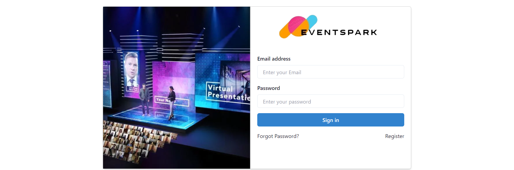
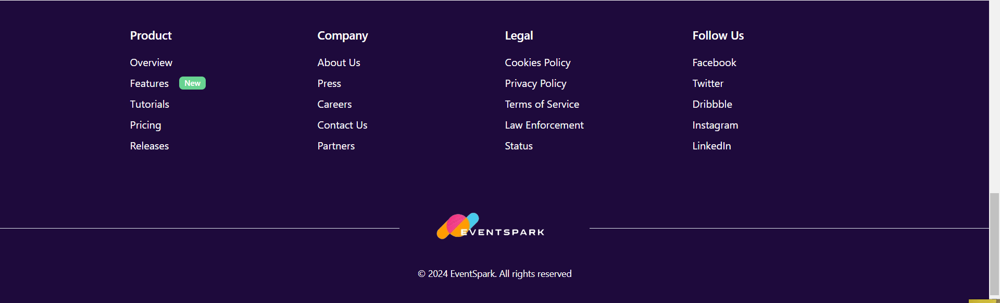

# EventSpark

## Introduction
The EventSpark website is a comprehensive platform that simplifies event planning and management. It allows users to book events, create their own events, and offers a responsive layout for seamless access across various devices.

## Project Type
Fullstack ( MERN )

## Directory Structure
EventSpark/<br>
├─ Server/<br>
│  ├─ config/<br>
│  ├─ controllers/<br>
│  ├─ middlewares/<br>
│  ├─ models/<br>
│  ├─ routes/<br>
│  ├─ index.js<br>
│  └─ package.json<br>
└─ EventSpark/<br>
|&nbsp;&nbsp;&nbsp;├─ public/<br>
|&nbsp;&nbsp;&nbsp;│&nbsp;&nbsp;&nbsp;├─ vite.svg/<br>
|&nbsp;&nbsp;&nbsp;├─ src/<br>
|&nbsp;&nbsp;&nbsp;│&nbsp;&nbsp;&nbsp;├─ Admin/<br>
|&nbsp;&nbsp;&nbsp;│&nbsp;&nbsp;&nbsp;├─ components/<br>
|&nbsp;&nbsp;&nbsp;│&nbsp;&nbsp;&nbsp;├─ EventPage/<br>
|&nbsp;&nbsp;&nbsp;│&nbsp;&nbsp;&nbsp;├─ Pages/<br>
|&nbsp;&nbsp;&nbsp;│&nbsp;&nbsp;&nbsp;├─ routes/<br>
|&nbsp;&nbsp;&nbsp;│&nbsp;&nbsp;&nbsp;├─ App.js<br>
|&nbsp;&nbsp;&nbsp;│&nbsp;&nbsp;&nbsp;├─ App.test.js<br>
|&nbsp;&nbsp;&nbsp;│&nbsp;&nbsp;&nbsp;├─ index.js<br>
|&nbsp;&nbsp;&nbsp;│&nbsp;&nbsp;&nbsp;├─ postcss.config.js<br>
|&nbsp;&nbsp;&nbsp;│&nbsp;&nbsp;&nbsp;└─ vite.config.js<br>
|&nbsp;&nbsp;&nbsp;│&nbsp;&nbsp;&nbsp;└─ tailwind.config.js<br>
|&nbsp;&nbsp;&nbsp;├─ .env<br>
|&nbsp;&nbsp;&nbsp;├─ .gitignore<br>
|&nbsp;&nbsp;&nbsp;├─ package-lock.json<br>
|&nbsp;&nbsp;&nbsp;└─ package.json<br>


## Deployed App
Frontend: https://eventspark.netlify.app/  </br>
Backend:  https://eventspark-ldbp.onrender.com/


## Video Walkthrough of the project
[](https://www.youtube.com/watch?v=kzgs5bzcYe0)


## Video Walkthrough of the project:
https://youtu.be/fEFdT0dGB2M

## Credentials
In order to be able to access the Admin Dashboard, enter these credentials in the Login Page :
```bash
Email: ranjiv@gmail.com
Password: 1234
```

## Features
- Secure user registration and authentication
- Personalizable user profiles with pictures and information
- Ability to create, edit, and share posts with text, images, and links
- Dynamic news feed displaying posts from friends and global Events
- Event management features
- Create management system
- Event creation, editing, Deleting, and viewing
- User search functionality
- Customizable user settings
- Responsive design across devices
- Data security with encryption and secure connections

## Design Decisions or Assumptions
The development focused on creating an intuitive and secure platform that emphasizes community building among food enthusiasts. Assumptions include a high engagement rate based on quality content and user-friendly features.

# Navbar


# SignIn / SignUp


# Mid-Section / Carousel


# Profile 


# Footer



## Installation & Getting Started
```bash
git 
cd EventSpark/EventSpark
npm install
npm start
cd ../backend
npm install
npm run server
```

## Technology Stack
- Frontend: React.js, Chakara UI
- Backend: Node.js, Express.js
- Database: MongoDB
- Other: Mongoose, bcrypt, JWT

## Contributors
EventSpark is a collabrative project. Meet our collaborators:

Renuka Jagrwal(Team lead) fw29_183
<br>
Aman choube ft30_113
<br>
Anuj Kshatriya ft30_043


